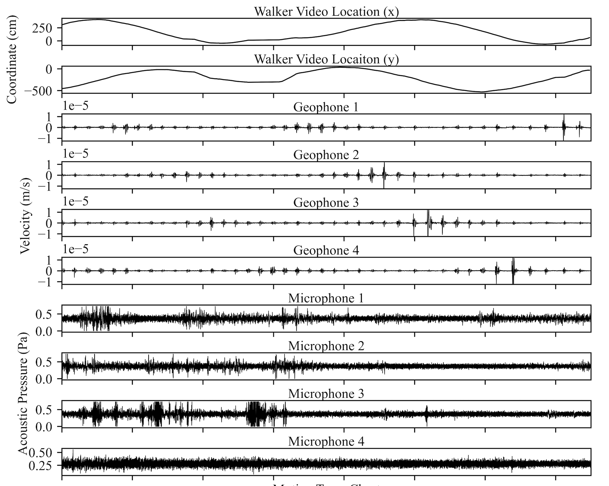

---

##### Download

+ [Paper](https://doi.org/10.21741/9781644902455-39)

---

##### Abstract

Human performance monitoring in complex operational environments calls for sensing solutions that measure human physiology as well as human interactions with their surroundings. Recent advances in multimodal sensing have led to the development of intelligent environments that analyze human activities with high granularity. One of the greatest challenges is to unify multiple discrete sensing systems through synchronization and integration of multimodal data streams. This paper describes an intelligent environment that consolidates wearable skin-strain sensors for physiological monitoring; geophones and microphones to record ambient vibrations and sounds; and video cameras to visually observe human activities. We show proof-of-concept functionality by using the system to differentiate walking effort in human subjects. First, the work shows the alignment of wearable and ambient sensor time-history records. Then, data features are extracted and correlated to walking speed using three sensor modalities. Finally, feature-level analysis is done to associate the data features with the perceived walking exertion for each subject.

---

##### Figure: Multimodal Sensor Data for Walking Effort Characterization



---

##### Citation

Appelle, Aaron, Liming Salvino, Yun-An Lin, Taylor Pierce, Emerson Noble, Gabriel Draughon, Kenneth J. Loh, and Jerome P. Lynch. 2023. "Integration of wearable and ambient sensors towards characterization of physical effort." *Materials Research Proceedings*, Vol. 27, pp. 300-307. https://doi.org/10.21741/9781644902455-39.

```BibTeX
@inproceedings{Appelle2023APWSHM,
author = {Aaron Appelle and Liming Salvino and Yun-An Lin and Taylor Pierce and Emerson Noble and Gabriel Draughon and Kenneth J. Loh and Jerome P. Lynch},
year = {2023},
month = {March},
title = {Integration of wearable and ambient sensors towards characterization of physical effort},
booktitle = {Materials Research Proceedings},
volume = {27},
pages = {300--307},
doi = {10.21741/9781644902455-39},
url = {https://doi.org/10.21741/9781644902455-39}}
```

---

##### Related material

+ [Publisher's website](https://doi.org/10.21741/9781644902455-39)


