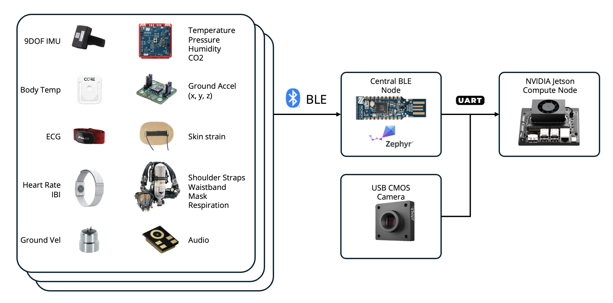

---

##### Download

+ [Paper](https://doi.org/10.1117/12.3050331)

---

##### Abstract

Naval ship environments are harsh and physically demanding settings for ship crews. During emergency response scenarios, such as blast, fire, and flooding, significant physiological and psychological stress is imposed on the damage control teams responsible for quickly mobilizing and addressing damage events. To address the need to reliably and quantitatively monitor the interplay of environmental conditions and crew health, this paper develops a holistic shipboard monitoring system that provides real-time actionable information from environmental and wearable sensors to enhance the performance and safety of damage control crews, reduce uncertainty in damage response decision-making, and enhance ship resilience for maximal survival probability. The shipboard monitoring system is composed of extremely low-power wearable sensors that monitor crew kinematic and biometric (e.g., heart rate) data in addition to ship environmental conditions. Since the metal ship construction blocks common wireless signals such as GPS and cellular frequencies, Bluetooth Low Energy (BLE) is instead utilized to pass data from the sensors to compute nodes deployed in each compartment. The compute nodes aggregate and analyze multimodal visual and sensor data in real time before transmitting actionable information to crew leads over a local area network. The shipboard monitoring system has been validated through tests performed on retired battleships and active US Navy Littoral Combat Ships (LCS). Results demonstrated success in collecting synchronized multimodal data across two ship compartments, laying the foundation for future research into real-time crew health and performance tracking.

---

##### Figure: Shipboard Monitoring System Architecture



---

##### Citation

Stach, Eric, Aaron Appelle, Jerome Lynch, and Liming Salvino. 2025. "Embedded sensing system for shipboard damage control scenarios." *Proc. SPIE*. https://doi.org/10.1117/12.3050331.

```BibTeX
@inproceedings{Stach2025SPIE,
author = {Eric Stach and Aaron Appelle and Jerome Lynch and Liming Salvino},
year = {2025},
month = {May},
title = {Embedded sensing system for shipboard damage control scenarios},
booktitle = {Proc. SPIE},
doi = {10.1117/12.3050331},
url = {https://doi.org/10.1117/12.3050331}}
```

---

##### Related material

+ [Publisher's website](https://doi.org/10.1117/12.3050331)


