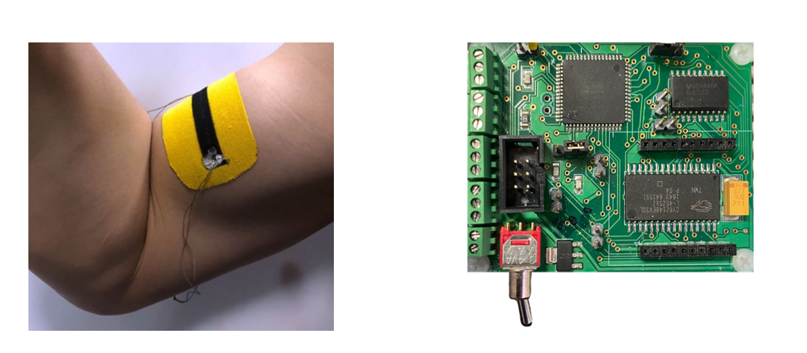

---

##### Download

+ [Paper](https://doi.org/10.1007/978-3-031-07254-3_90)

---

##### Abstract

A primary concern during physically demanding activities is the risk of musculoskeletal injury. Sensing systems that monitor muscle activity can provide early warnings of physical fatigue, thereby improving the safety and effectiveness of labor. This work presents one such system in the form of a power-efficient, wearable sensing platform to infer distributed muscle exertion in real time. The system uses "Motion Tape," which is a new type of skin-strain sensor fabricated by integrating graphene nanosheet thin films with commercially available kinesiology tape (K-Tape) that is then attached to human subjects. Here, Motion Tape is interfaced with the Urbano IoT sensor node, which includes an onboard microprocessor, wireless transceiver, analog-to-digital converter, input/output peripherals, and memory. In contrast to existing body sensor networks that require many sensors and nodes to monitor physical activity, the system presented herein captures distributed muscle engagement and skin strains over larger areas with fewer sensor nodes. This work introduces a new wearable sensor platform to monitor muscle exertion in real time using graphene Motion Tape, a novel type of self-adhering skin-strain sensor. This wearable sensor platform can capture distributed muscle engagement and skin strains over larger areas with fewer sensor nodes. To address the real-time inference challenge, we utilize the Urbano IoT sensor node to perform a Compressed Sensing (CS) data acquisition process and wirelessly communicate data features from the compressive domain. A preliminary validation on Motion Tape signals from humans performing bicep curls shows the promise of a supervised linear regression model to infer the weight lifted as a proxy for intensity of muscle exertion.

---

##### Figure: Graphene Motion Tape and Sensor System



---

##### Citation

Appelle, Aaron, Yun-An Lin, Emerson Noble, Liming Salvino, Kenneth J. Loh, and Jerome P. Lynch. 2022. "Wearable Sensor Platform to Monitor Physical Exertion Using Graphene Motion Tape." In *European Workshop on Structural Health Monitoring. EWSHM 2022. Lecture Notes in Civil Engineering*, vol. 253, pp. 894-904. Springer, Cham. https://doi.org/10.1007/978-3-031-07254-3_90.

```BibTeX
@inproceedings{Appelle2022EWSHM,
author = {Aaron Appelle and Yun-An Lin and Emerson Noble and Liming Salvino and Kenneth J. Loh and Jerome P. Lynch},
year = {2022},
month = {June},
title = {Wearable Sensor Platform to Monitor Physical Exertion Using Graphene Motion Tape},
booktitle = {European Workshop on Structural Health Monitoring. EWSHM 2022. Lecture Notes in Civil Engineering},
volume = {253},
pages = {894--904},
publisher = {Springer, Cham},
doi = {10.1007/978-3-031-07254-3_90},
url = {https://doi.org/10.1007/978-3-031-07254-3_90}}
```

---

##### Related material

+ [Publisher's website](https://doi.org/10.1007/978-3-031-07254-3_90)


