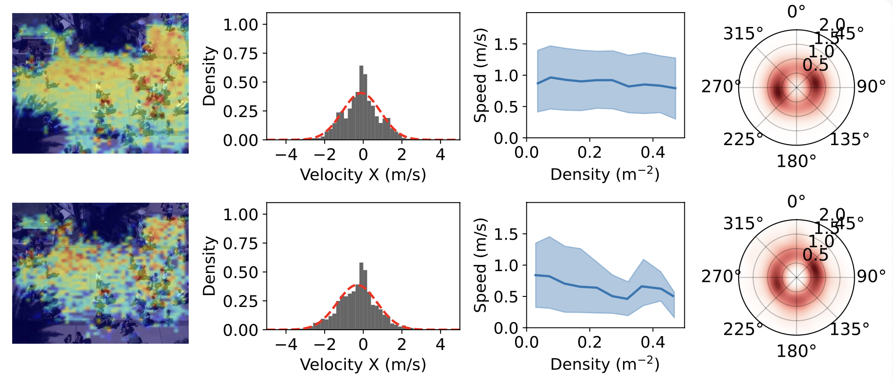

---

##### Download

+ [Paper](https://doi.org/10.48550/arXiv.2510.17731)
+ [Workshop Website](https://physical-world-modeling.github.io/)

---

##### Abstract

Recent high-performing image-to-video (I2V) models based on variants of the diffusion transformer (DiT) have displayed remarkable inherent world-modeling capabilities by virtue of training on large scale video datasets. We investigate whether these models can generate realistic pedestrian movement patterns in crowded public scenes. Our framework conditions I2V models on keyframes extracted from pedestrian trajectory benchmarks, then evaluates their trajectory prediction performance using quantitative measures of pedestrian dynamics.

---

##### Figure: Image-To-Video Models for Pedestrian Dynamics



---

##### Citation

Appelle, Aaron, and Jerome P. Lynch. 2025. "Can Image-To-Video Models Simulate Pedestrian Dynamics?" *ICML 2025 Workshop on Building Physically Plausible World Models*. https://doi.org/10.48550/arXiv.2510.17731.

```BibTeX
@inproceedings{Appelle2025ICML,
author = {Aaron Appelle and Jerome P. Lynch},
year = {2025},
month = {July},
title = {Can Image-To-Video Models Simulate Pedestrian Dynamics?},
booktitle = {ICML 2025 Workshop on Building Physically Plausible World Models},
url = {https://doi.org/10.48550/arXiv.2510.17731}}
```

---

##### Related material

+ [arXiv Preprint](https://doi.org/10.48550/arXiv.2510.17731)
+ [Workshop Website](https://physical-world-modeling.github.io/)


