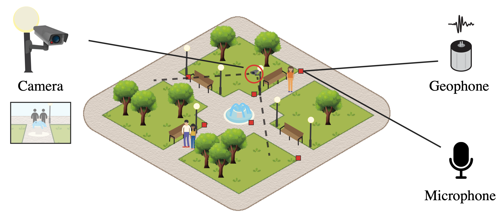

---

##### Download

+ [Paper](https://doi.org/10.1061/JCCEE5.CPENG-6869)

---

##### Abstract

Works of social infrastructure, such as public parks and markets, play a crucial role in fostering well-being in urban communities. To evaluate their effectiveness, there is a need for nonintrusive, continuous mapping of pedestrian movement patterns. While video cameras can track human interaction, there is currently no reliable alternative in applications where video surveillance is impractical due to privacy concerns. Audio-based acoustic localization methods face significant challenges in outdoor environments due to ambient noise and signal interference. This paper introduces a novel deep-learning-based footstep localization system using ground vibrations measured using geophones and develops a scalable method to automatically collect training data. The system estimates the time differences of arrival (TDOA) of incoming ground vibration signals using a one-dimensional convolutional neural network (1D-CNN), enabling the localization of individual pedestrians and small groups. A scalable approach using a pre-trained computer vision model to detect and track pedestrians in video images is used to automate the creation of a large dataset for training and validation of the 1D-CNN localization model. A human subject validation study conducted in an urban setting demonstrates significant advantages over both speech-based acoustic localization systems and conventional signal-processing methods for TDOA estimation. The system achieves a localization error of 0.795 m for individuals and 1.61 m for groups of two to three people walking together over a 20-m-wide outdoor area. The 1D-CNN model shows a 41.5% improvement in TDOA estimation over baseline methods such as cross-correlation.

---

##### Figure 1: Footstep Vibration-Based Pedestrian Localization System



---

##### Citation

Appelle, Aaron. 2024. "Automated and Scalable Footstep Vibration-Based Pedestrian Localization in Built Environments Using Deep Learning." *Journal of Computing in Civil Engineering*. https://ascelibrary.org/doi/full/10.1061/JCCEE5.CPENG-6869.

```BibTeX
@article{Appelle2024,
author = {Aaron Appelle},
year = {2024},
title = {Automated and Scalable Footstep Vibration-Based Pedestrian Localization in Built Environments Using Deep Learning},
journal = {Journal of Computing in Civil Engineering},
url = {https://ascelibrary.org/doi/full/10.1061/JCCEE5.CPENG-6869}}
```

---

##### Related material

+ [Publisher's website](https://ascelibrary.org/doi/full/10.1061/JCCEE5.CPENG-6869)

