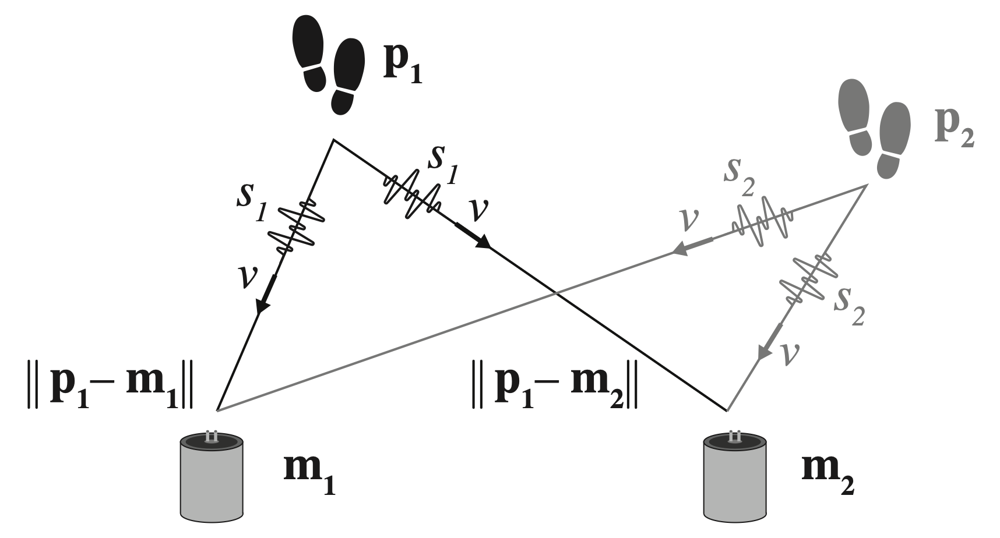

---

##### Download

+ [Paper](https://doi.org/10.1117/12.3009826)

---

##### Abstract

This paper presents a resource-constrained localization system that uses geophones to map pedestrian locations in outdoor spaces. It addresses the need to non-intrusively monitor the level of community utilization of social infrastructure, such as public parks and markets. The system measures the time differences of arrival (TDOA) of footstep ground vibration signals to localize people using hyperbolic positioning. However, signal noise and dispersion impair conventional approaches like cross-correlation to compute the TDOA. This paper introduces a 1D-convolutional neural network model to compute the TDOA based on training data collected at the deployment setting. The model takes short windows of synchronized geophone time-series as input and provides a real-time estimation of the time difference. Results from a validation study in an urban setting show that the TDOA model outperforms baseline methods by over 60%, achieving a localization accuracy of less than 1 meter for single pedestrians.

---

##### Figure: Pedestrian Footstep Localization System



---

##### Citation

Appelle, Aaron, Liming Salvino, and Jerome P. Lynch. 2024. "Pedestrian footstep localization using a deep convolutional network for time difference of arrival estimation." *Proc. SPIE 12950, Sensors and Smart Structures Technologies for Civil, Mechanical, and Aerospace Systems 2024*, 129500H. https://doi.org/10.1117/12.3009826.

```BibTeX
@inproceedings{Appelle2024SPIE,
author = {Aaron Appelle and Liming Salvino and Jerome P. Lynch},
year = {2024},
title = {Pedestrian footstep localization using a deep convolutional network for time difference of arrival estimation},
booktitle = {Proc. SPIE 12950, Sensors and Smart Structures Technologies for Civil, Mechanical, and Aerospace Systems 2024},
volume = {12950},
pages = {129500H},
doi = {10.1117/12.3009826},
url = {https://doi.org/10.1117/12.3009826}}
```

---

##### Related material

+ [Publisher's website](https://doi.org/10.1117/12.3009826)


