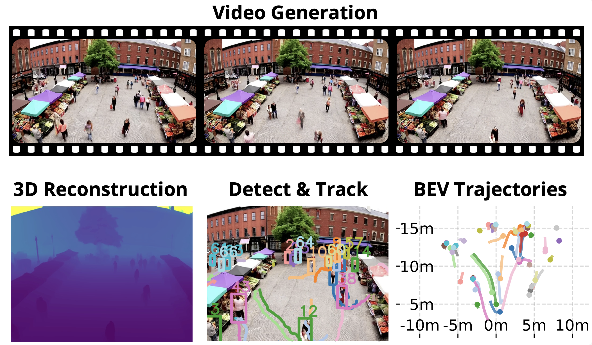

---

##### Download

+ [Paper](https://doi.org/10.48550/arXiv.2510.20182)

---

##### Abstract

Large-scale video generation models have demonstrated high visual realism in diverse contexts, spurring interest in their potential as general-purpose world simulators. Existing benchmarks focus on individual subjects rather than scenes with multiple interacting people. However, the plausibility of multi-agent dynamics in generated videos remains unverified. We propose a rigorous evaluation protocol to benchmark text-to-video (T2V) and image-to-video (I2V) models as implicit simulators of pedestrian dynamics. For I2V, we leverage start frames from established datasets to enable comparison with a ground truth video dataset. For T2V, we develop a prompt suite to explore diverse pedestrian densities and interactions. A key component is a method to reconstruct 2D bird's-eye view trajectories from pixel-space without known camera parameters. Our analysis reveals that leading models have learned surprisingly effective priors for plausible multi-agent behavior. However, failure modes like merging and disappearing people highlight areas for future improvement.

---

##### Figure: Video Generation and Pedestrian Trajectory Analysis



---

##### Citation

Appelle, Aaron, and Jerome P. Lynch. 2025. "Evaluating Video Models as Simulators of Multi-Person Pedestrian Trajectories." *arXiv preprint arXiv:2510.20182*. https://doi.org/10.48550/arXiv.2510.20182.

```BibTeX
@article{Appelle2025Video,
author = {Aaron Appelle and Jerome P. Lynch},
year = {2025},
month = {October},
title = {Evaluating Video Models as Simulators of Multi-Person Pedestrian Trajectories},
journal = {arXiv preprint arXiv:2510.20182},
url = {https://doi.org/10.48550/arXiv.2510.20182}}
```

---

##### Related material

+ [arXiv Preprint](https://doi.org/10.48550/arXiv.2510.20182)


